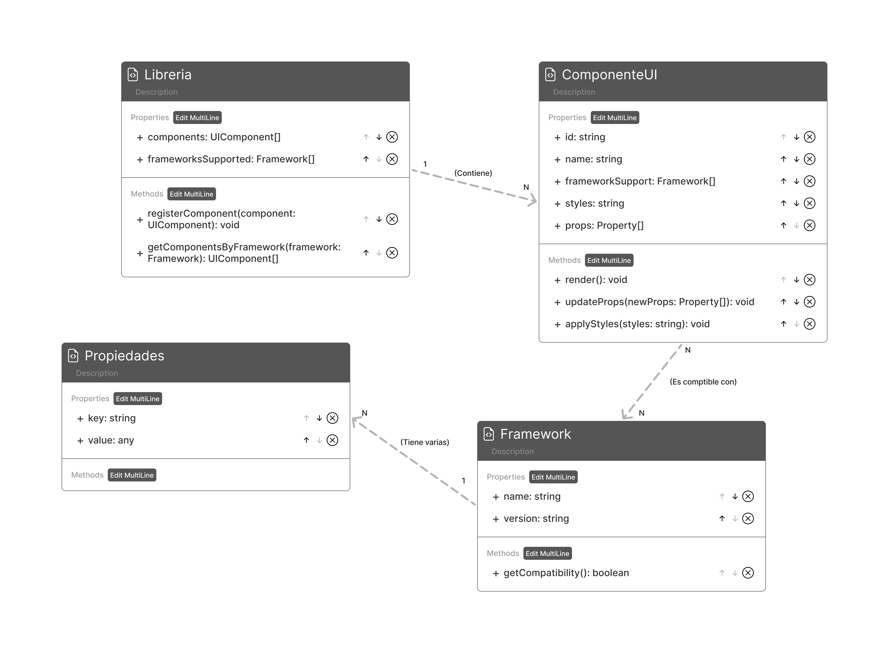
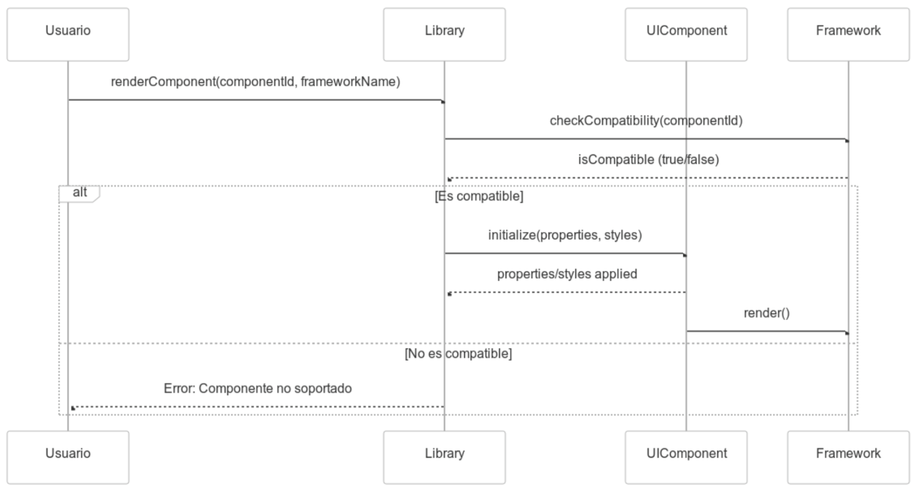
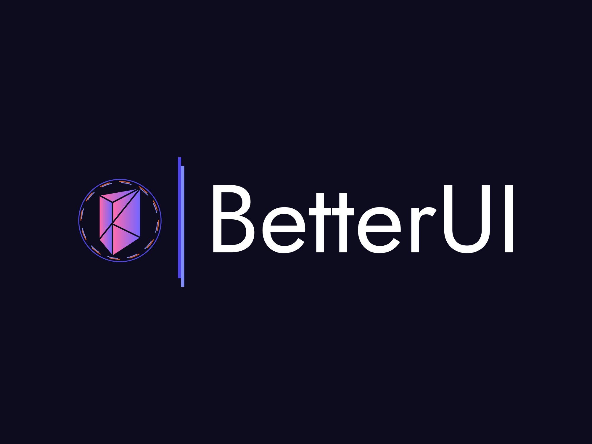

# 📌 Better UI

  
📖 Explicación idea del proyecto

  
  - Este proyecto consiste en el desarrollo de una librería de componentes UI multiplataforma, diseñada para ser compatible con los frameworks más utilizados, como Vue, React, Angular, Svelte y Vanilla JavaScript. El objetivo es ofrecer una solución eficiente y versátil que permita a los desarrolladores integrar componentes consistentes, estilizados y accesibles en sus aplicaciones, independientemente de la tecnología que utilicen. A través de una arquitectura modular, herramientas de personalización y soporte para estándares modernos como Web Components, esta librería simplificará el proceso de desarrollo, promoviendo la reutilización de código y una experiencia de usuario consistente en diferentes entornos.

  
🎯 Nuestros Objetivos

  
  - Desarrollar un conjunto de componentes de interfaz de usuario preconstruidos y altamente personalizables para acelerar el desarrollo de aplicaciones Nuxt.js o otros lenguajes y frameworks.
  

  
🌐 Tecnologías Usadas

  
  - Lenguaje o framework principal (Docs): Nuxt.js   
  - Otras herramientas: Tailwind y los diferentes frameworks para los que estará disponible el paquete. 
  

  
📈 Diagramas

    
  
  
  

  
💻 Página Web

  
  - URL: [Enlace a la página](#)
  

  
🎨 Paleta De Colores

  
  - Color Primario: `#4f46e5`
  - Color Secundario: `#E45C22`
  - Color Terciario: `#808EF9`
  

  
👀 Logo

  
  
  

  
🔗 Funcionalidades Web

  
  - ✅ Manual de instalación y uso de la libreria para los diferentes lenguajes
  - ✅ Showcase de los diferentes componentes
  

---
